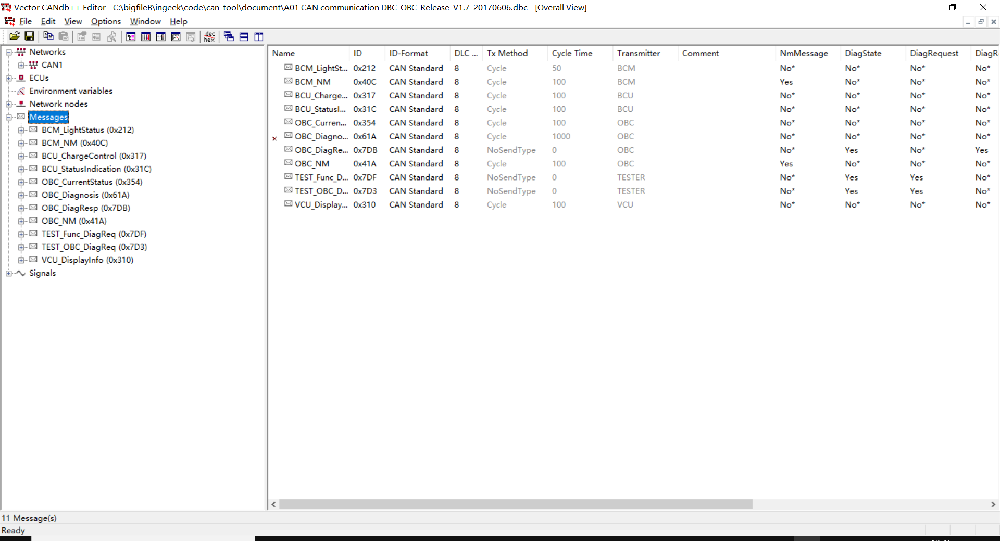
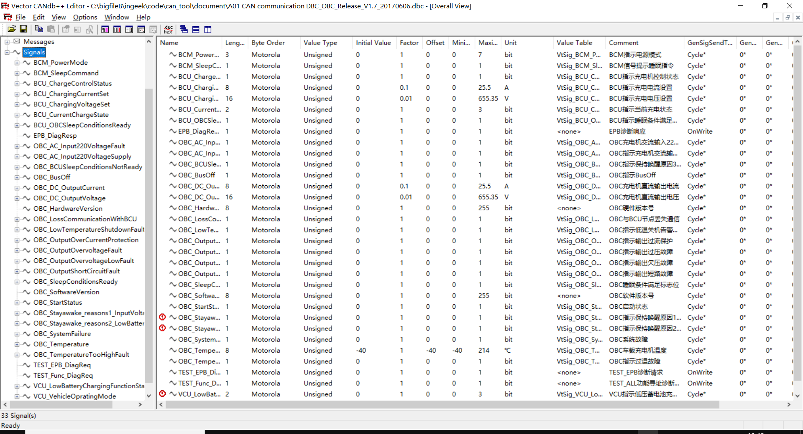

dbc
================

.. image:: ./image_dbc/network_node.png

::

    VERSION ""

    NS_ : 
            NS_DESC_
            CM_
            BA_DEF_
            BA_
            VAL_
            CAT_DEF_
            CAT_
            FILTER
            BA_DEF_DEF_
            EV_DATA_
            ENVVAR_DATA_
            SGTYPE_
            SGTYPE_VAL_
            BA_DEF_SGTYPE_
            BA_SGTYPE_
            SIG_TYPE_REF_
            VAL_TABLE_
            SIG_GROUP_
            SIG_VALTYPE_
            SIGTYPE_VALTYPE_
            BO_TX_BU_
            BA_DEF_REL_
            BA_REL_
            BA_DEF_DEF_REL_
            BU_SG_REL_
            BU_EV_REL_
            BU_BO_REL_
            SG_MUL_VAL_

    BS_:

    BU_: AC BCM BCU DCM EPB EPS HMI MCU OBC TESTER VCU 

    BO_ 1036 BCM_NM: 8 BCM
     SG_ BCM_SleepCommand : 0|1@0+ (1,0) [0|1] "bit" VCU,MCU,BCU,DCM,HMI,EPB,OBC

    BO_ 1050 OBC_NM: 8 OBC
     SG_ OBC_SleepConditionsReady : 0|1@0+ (1,0) [0|1] "bit" BCM
     SG_ OBC_Stayawake_reasons1_InputVoltage : 16|1@0+ (1,0) [0|1] "bit" Vector__XXX
     SG_ OBC_Stayawake_reasons2_LowBatteryCharging : 17|1@0+ (1,0) [0|1] "bit" Vector__XXX
     SG_ OBC_BCUSleepConditionsNotReady : 18|1@0+ (1,0) [0|1] "bit" Vector__XXX

    BO_ 1562 OBC_Diagnosis: 8 OBC
     SG_ OBC_OutputOvervoltageFault : 0|1@0+ (1,0) [0|1] "bit" Vector__XXX
     SG_ OBC_OutputOvervoltageLowFault : 1|1@0+ (1,0) [0|1] "bit" Vector__XXX
     SG_ OBC_OutputShortCircuitFault : 2|1@0+ (1,0) [0|1] "bit" Vector__XXX
     SG_ OBC_TemperatureTooHighFault : 3|1@0+ (1,0) [0|1] "bit" Vector__XXX
     SG_ OBC_LowTemperatureShutdownFault : 4|1@0+ (1,0) [0|1] "bit" Vector__XXX
     SG_ OBC_SoftwareVersion : 55|8@0+ (1,0) [0|255] "bit" Vector__XXX
     SG_ OBC_AC_Input220VoltageFault : 5|1@0+ (1,0) [0|1] "bit" Vector__XXX
     SG_ OBC_HardwareVersion : 63|8@0+ (1,0) [0|255] "bit" Vector__XXX
     SG_ OBC_OutputOverCurrentProtection : 6|1@0+ (1,0) [0|1] "bit" Vector__XXX
     SG_ OBC_LossCommunicationWithBCU : 7|1@0+ (1,0) [0|1] "bit" Vector__XXX
     SG_ OBC_BusOff : 8|1@0+ (1,0) [0|1] "bit" Vector__XXX

    BO_ 2003 TEST_OBC_DiagReq: 8 TESTER
     SG_ TEST_EPB_DiagReq : 0|1@0+ (1,0) [0|1] "bit" OBC

    BO_ 2011 OBC_DiagResp: 8 OBC
     SG_ EPB_DiagResp : 0|1@0+ (1,0) [0|1] "bit" TESTER

    BO_ 2015 TEST_Func_DiagReq: 8 TESTER
     SG_ TEST_Func_DiagReq : 0|1@0+ (1,0) [0|1] "bit" VCU,MCU,BCU,AC,BCM,DCM,HMI,EPS,EPB,OBC

    BO_ 530 BCM_LightStatus: 8 BCM
     SG_ BCM_PowerMode : 11|3@0+ (1,0) [0|7] "bit" VCU,DCM,HMI,EPB,OBC

    BO_ 784 VCU_DisplayInfo: 8 VCU
     SG_ VCU_VehicleOpratingMode : 6|2@0+ (1,0) [0|3] "bit" MCU,BCU,HMI,OBC
     SG_ VCU_LowBatteryChargingFunctionState : 31|2@0+ (1,0) [0|3] "bit" BCU,OBC

    BO_ 791 BCU_ChargeControl: 8 BCU
     SG_ BCU_ChargeControlStatus : 8|1@0+ (1,0) [0|1] "bit" OBC
     SG_ BCU_CurrentChargeState : 10|2@0+ (1,0) [0|3] "bit" VCU,MCU,HMI,OBC
     SG_ BCU_ChargingVoltageSet : 23|16@0+ (0.01,0) [0|655.35] "V" OBC
     SG_ BCU_ChargingCurrentSet : 39|8@0+ (0.1,0) [0|25.5] "A" OBC

    BO_ 796 BCU_StatusIndication: 8 BCU
     SG_ BCU_OBCSleepConditionsReady : 50|1@0+ (1,0) [0|1] "bit" OBC

    BO_ 852 OBC_CurrentStatus: 8 OBC
     SG_ OBC_StartStatus : 0|1@0+ (1,0) [0|1] "bit" BCU
     SG_ OBC_SystemFailure : 1|1@0+ (1,0) [0|1] "bit" BCU
     SG_ OBC_AC_Input220VoltageSupply : 2|1@0+ (1,0) [0|1] "bit" BCU
     SG_ OBC_DC_OutputVoltage : 39|16@0+ (0.01,0) [0|655.35] "V" BCU
     SG_ OBC_DC_OutputCurrent : 55|8@0+ (0.1,0) [0|25.5] "A" BCU
     SG_ OBC_Temperature : 63|8@0+ (1,-40) [-40|214] "℃" Vector__XXX

    CM_ " ";

    CM_ SG_ 852 OBC_StartStatus "OBC启动状态";
    CM_ SG_ 852 OBC_SystemFailure "OBC系统故障";
    CM_ SG_ 852 OBC_AC_Input220VoltageSupply "OBC指示充电机交流输入220V电压是否加载";
    CM_ SG_ 852 OBC_DC_OutputVoltage "OBC充电机直流输出电压";
    CM_ SG_ 852 OBC_DC_OutputCurrent "OBC充电机直流输出电流";
    CM_ SG_ 852 OBC_Temperature "OBC车载充电机温度";
    CM_ SG_ 1050 OBC_SleepConditionsReady "OBC睡眠条件满足标志位";
    CM_ SG_ 1050 OBC_Stayawake_reasons1_InputVoltage "OBC指示保持唤醒原因1_输入交流电压存在且充电未完成";
    CM_ SG_ 1050 OBC_Stayawake_reasons2_LowBatteryCharging "OBC指示保持唤醒原因2_小电池电量低充电开始";
    CM_ SG_ 1050 OBC_BCUSleepConditionsNotReady "OBC指示保持唤醒原因3_BCU睡眠条件不满足";
    CM_ SG_ 1562 OBC_OutputOvervoltageFault "OBC指示输出过压故障";
    CM_ SG_ 1562 OBC_OutputOvervoltageLowFault "OBC指示输出欠压故障";
    CM_ SG_ 1562 OBC_OutputShortCircuitFault "OBC指示输出短路故障";
    CM_ SG_ 1562 OBC_TemperatureTooHighFault "OBC指示过温故障";
    CM_ SG_ 1562 OBC_LowTemperatureShutdownFault "OBC指示低温关机告警（故障）";
    CM_ SG_ 1562 OBC_SoftwareVersion "OBC软件版本号";
    CM_ SG_ 1562 OBC_AC_Input220VoltageFault "OBC充电机交流输入220电压故障状态";
    CM_ SG_ 1562 OBC_HardwareVersion "OBC硬件版本号";
    CM_ SG_ 1562 OBC_OutputOverCurrentProtection "OBC指示输出过流保护";
    CM_ SG_ 1562 OBC_LossCommunicationWithBCU "OBC与BCU节点丢失通信";
    CM_ SG_ 1562 OBC_BusOff "OBC指示BusOff";
    CM_ SG_ 2011 EPB_DiagResp "EPB诊断响应";
    CM_ SG_ 784 VCU_VehicleOpratingMode "VCU指示当前车辆运行模式";
    CM_ SG_ 784 VCU_LowBatteryChargingFunctionState "VCU指示低压蓄电池充电功能状态";
    CM_ SG_ 791 BCU_ChargeControlStatus "BCU指示充电机控制状态";
    CM_ SG_ 791 BCU_CurrentChargeState "BCU指示当前充电状态";
    CM_ SG_ 791 BCU_ChargingVoltageSet "BCU指示充电电压设置";
    CM_ SG_ 791 BCU_ChargingCurrentSet "BCU指示充电电流设置";
    CM_ SG_ 796 BCU_OBCSleepConditionsReady "BCU指示睡眠条件满足（OBC用于睡眠条件判断）";
    CM_ SG_ 530 BCM_PowerMode "BCM指示电源模式";
    CM_ SG_ 1036 BCM_SleepCommand "BCM信号提示睡眠指令";
    CM_ SG_ 2003 TEST_EPB_DiagReq "TEST_EPB诊断请求";
    CM_ SG_ 2015 TEST_Func_DiagReq "TEST_ALL功能寻址诊断请求";

    BA_DEF_ BO_  "NmMessage" ENUM "No","Yes";
    BA_DEF_ BO_  "DiagState" ENUM  "No","Yes";
    BA_DEF_ BO_  "DiagRequest" ENUM  "No","Yes";
    BA_DEF_ BO_  "DiagResponse" ENUM  "No","Yes";
    BA_DEF_ BO_  "GenMsgSendType" ENUM  "Cycle","NoSendType","IfActive";
    BA_DEF_ BO_  "GenMsgCycleTime" INT 0 0;
    BA_DEF_ SG_  "GenSigSendType" ENUM  "Cycle","OnChange","OnWrite","IfActive","OnChangeWithRepetition","OnWriteWithRepetition","IfActiveWithRepetition";
    BA_DEF_ SG_  "GenSigStartValue" INT 0 0;
    BA_DEF_ SG_  "GenSigInactiveValue" INT 0 0;
    BA_DEF_ BO_  "GenMsgCycleTimeFast" INT 0 0;
    BA_DEF_ BO_  "GenMsgNrOfRepetition" INT 0 0;
    BA_DEF_ BO_  "GenMsgDelayTime" INT 0 0;
    BA_DEF_  "DBName" STRING ;
    BA_DEF_ BU_  "NodeLayerModules" STRING ;
    BA_DEF_ SG_  "GenSigTimeoutValue" INT 0 1000000000;
    BA_DEF_ BO_  "GenMsgCycleTimeActive" INT 0 0;
    BA_DEF_ BU_  "ILUsed" ENUM  "No","Yes";
    BA_DEF_ BU_  "TpNodeBaseAddress" HEX 0 2047;
    BA_DEF_ BU_  "TpTxIdentifier" HEX 0 2047;
    BA_DEF_ BU_  "TpRxIdentifier" HEX 0 2047;
    BA_DEF_ BU_  "TpRxMask" HEX 0 2047;
    BA_DEF_ BU_  "TpCanBus" INT 1 2;
    BA_DEF_ BU_  "TpTxAdrMode" INT 0 1;
    BA_DEF_ BU_  "TpAddressExtension" INT 0 100000000;
    BA_DEF_ BU_  "TpSTMin" INT 0 1000000000;
    BA_DEF_ BU_  "TpBlockSize" INT 0 10000000;
    BA_DEF_ BU_  "TpAddressingMode" INT 0 4;
    BA_DEF_ BU_  "TpTargetAddress" HEX 0 255;
    BA_DEF_ BU_  "TpUseFC" INT 0 1;
    BA_DEF_ BU_  "DiagStationAddress" HEX 0 255;
    BA_DEF_ BU_  "NmNode" ENUM  "Not","Yes";
    BA_DEF_ BU_  "NmStationAddress" HEX 0 65535;
    BA_DEF_ BU_  "NmCAN" INT 0 2;
    BA_DEF_  "Manufacturer" STRING ;
    BA_DEF_  "VersionYear" INT 0 99;
    BA_DEF_  "VersionMonth" INT 0 12;
    BA_DEF_  "VersionWeek" INT 0 52;
    BA_DEF_  "VersionDay" INT 0 31;
    BA_DEF_  "VersionNumber" INT 0 0;
    BA_DEF_  "TpBaseAddress" HEX 0 2047;
    BA_DEF_  "NmType" STRING ;
    BA_DEF_  "NmBaseAddress" HEX 0 2047;
    BA_DEF_  "NmMessageCount" INT 0 255;
    BA_DEF_ BO_  "_Cdb_Sc_CTm_FAW_v3_0" INT 0 0;
    BA_DEF_ BO_  "_Cdb_Sc_CTm_FAW_v2_3" INT 0 0;
    BA_DEF_ BO_  "_Cdb_Sc_CTm_FAW_v3_1" INT 0 0;
    BA_DEF_ EV_  "GenEnvAutoGenCtrl" ENUM  "No","Yes";
    BA_DEF_ EV_  "GenEnvMsgOffset" INT 0 2147483647;
    BA_DEF_ EV_  "GenEnvMsgName" STRING ;
    BA_DEF_ EV_  "GenEnvIsGeneratedSnd" ENUM  "No","Yes";
    BA_DEF_ SG_  "GenSigEnvVarType" ENUM  "int","float","undef";
    BA_DEF_  "GenEnvVarPrefix" STRING ;
    BA_DEF_  "GenEnvVarEndingSnd" STRING ;
    BA_DEF_  "GenEnvVarEndingDsp" STRING ;
    BA_DEF_ BO_  "_Cdb_Sc_CTm_FAW_v2_2" INT 0 0;
    BA_DEF_ BO_  "_Cdb_Sc_CTm_FAW_v2_1" INT 0 0;
    BA_DEF_ BO_  "GenMsgILSupport" ENUM  "No","Yes";
    BA_DEF_ BO_  "GenMsgStartDelayTime" INT 0 65535;
    BA_DEF_  "BusType" STRING ;
    BA_DEF_ SG_  "SystemSignalLongSymbol" STRING ;
    BA_DEF_REL_ BU_SG_REL_  "GenSigTimeoutTime" INT 0 10000000;
    BA_DEF_REL_ BU_SG_REL_  "GenSigTimeoutMsg" HEX 0 2047;

    BA_DEF_DEF_  "NmMessage" "No";
    BA_DEF_DEF_  "DiagState" "No";
    BA_DEF_DEF_  "DiagRequest" "No";
    BA_DEF_DEF_  "DiagResponse" "No";
    BA_DEF_DEF_  "GenMsgSendType" "Cycle";
    BA_DEF_DEF_  "GenMsgCycleTime" 0;
    BA_DEF_DEF_  "GenSigSendType" "Cycle";
    BA_DEF_DEF_  "GenSigStartValue" 0;
    BA_DEF_DEF_  "GenSigInactiveValue" 0;
    BA_DEF_DEF_  "GenMsgCycleTimeFast" 0;
    BA_DEF_DEF_  "GenMsgNrOfRepetition" 0;
    BA_DEF_DEF_  "GenMsgDelayTime" 0;
    BA_DEF_DEF_  "DBName" "";
    BA_DEF_DEF_  "NodeLayerModules" "CANoeILNLVector.dll";
    BA_DEF_DEF_  "GenSigTimeoutValue" 0;
    BA_DEF_DEF_  "GenMsgCycleTimeActive" 0;
    BA_DEF_DEF_  "ILUsed" "No";
    BA_DEF_DEF_  "TpNodeBaseAddress" 0;
    BA_DEF_DEF_  "TpTxIdentifier" 0;
    BA_DEF_DEF_  "TpRxIdentifier" 0;
    BA_DEF_DEF_  "TpRxMask" 0;
    BA_DEF_DEF_  "TpCanBus" 1;
    BA_DEF_DEF_  "TpTxAdrMode" 0;
    BA_DEF_DEF_  "TpAddressExtension" 0;
    BA_DEF_DEF_  "TpSTMin" 0;
    BA_DEF_DEF_  "TpBlockSize" 0;
    BA_DEF_DEF_  "TpAddressingMode" 0;
    BA_DEF_DEF_  "TpTargetAddress" 0;
    BA_DEF_DEF_  "TpUseFC" 0;
    BA_DEF_DEF_  "DiagStationAddress" 0;
    BA_DEF_DEF_  "NmNode" "Not";
    BA_DEF_DEF_  "NmStationAddress" 0;
    BA_DEF_DEF_  "NmCAN" 0;
    BA_DEF_DEF_  "Manufacturer" "";
    BA_DEF_DEF_  "VersionYear" 0;
    BA_DEF_DEF_  "VersionMonth" 0;
    BA_DEF_DEF_  "VersionWeek" 0;
    BA_DEF_DEF_  "VersionDay" 0;
    BA_DEF_DEF_  "VersionNumber" 0;
    BA_DEF_DEF_  "TpBaseAddress" 0;
    BA_DEF_DEF_  "NmType" "";
    BA_DEF_DEF_  "NmBaseAddress" 1024;
    BA_DEF_DEF_  "NmMessageCount" 128;
    BA_DEF_DEF_  "_Cdb_Sc_CTm_FAW_v3_0" 0;
    BA_DEF_DEF_  "_Cdb_Sc_CTm_FAW_v2_3" 0;
    BA_DEF_DEF_  "_Cdb_Sc_CTm_FAW_v3_1" 0;
    BA_DEF_DEF_  "GenEnvAutoGenCtrl" "No";
    BA_DEF_DEF_  "GenEnvMsgOffset" 0;
    BA_DEF_DEF_  "GenEnvMsgName" "";
    BA_DEF_DEF_  "GenEnvIsGeneratedSnd" "No";
    BA_DEF_DEF_  "GenSigEnvVarType" "undef";
    BA_DEF_DEF_  "GenEnvVarPrefix" "Env";
    BA_DEF_DEF_  "GenEnvVarEndingSnd" "_";
    BA_DEF_DEF_  "GenEnvVarEndingDsp" "Dsp_";
    BA_DEF_DEF_  "_Cdb_Sc_CTm_FAW_v2_2" 0;
    BA_DEF_DEF_  "_Cdb_Sc_CTm_FAW_v2_1" 0;
    BA_DEF_DEF_  "GenMsgILSupport" "No";
    BA_DEF_DEF_  "GenMsgStartDelayTime" 0;
    BA_DEF_DEF_  "BusType" "CAN";
    BA_DEF_DEF_REL_ "GenSigTimeoutTime" 0;
    BA_DEF_DEF_REL_ "GenSigTimeoutMsg" 0;
    BA_DEF_DEF_  "SystemSignalLongSymbol" "";
    BA_ "DBName" "CAN1";
    BA_ "NmMessage" BO_ 1036 1;
    BA_ "GenMsgCycleTime" BO_ 1036 100;
    BA_ "NmMessage" BO_ 1050 1;
    BA_ "GenMsgCycleTime" BO_ 1050 100;
    BA_ "GenMsgCycleTime" BO_ 1562 1000;
    BA_ "DiagState" BO_ 2003 1;
    BA_ "DiagRequest" BO_ 2003 1;
    BA_ "GenMsgSendType" BO_ 2003 1;
    BA_ "GenSigSendType" SG_ 2003 TEST_EPB_DiagReq 2;
    BA_ "DiagState" BO_ 2011 1;
    BA_ "DiagResponse" BO_ 2011 1;
    BA_ "GenMsgSendType" BO_ 2011 1;
    BA_ "GenSigSendType" SG_ 2011 EPB_DiagResp 2;
    BA_ "DiagState" BO_ 2015 1;
    BA_ "DiagRequest" BO_ 2015 1;
    BA_ "GenMsgSendType" BO_ 2015 1;
    BA_ "GenSigSendType" SG_ 2015 TEST_Func_DiagReq 2;
    BA_ "GenMsgCycleTime" BO_ 530 50;
    BA_ "GenMsgCycleTime" BO_ 784 100;
    BA_ "GenMsgCycleTime" BO_ 791 100;
    BA_ "GenMsgCycleTime" BO_ 796 100;
    BA_ "GenMsgCycleTime" BO_ 852 100;
    VAL_ 852 OBC_StartStatus 1 "Start Charging" 0 "Stop Charging" ;
    VAL_ 852 OBC_SystemFailure 1 "Failure" 0 "Nomal" ;
    VAL_ 852 OBC_AC_Input220VoltageSupply 1 "Supply" 0 "Not Supply" ;
    VAL_ 852 OBC_DC_OutputVoltage 65535 "Invalid" ;
    VAL_ 852 OBC_DC_OutputCurrent 255 "Invalid" ;
    VAL_ 852 OBC_Temperature 255 "Invalid" ;
    VAL_ 1050 OBC_SleepConditionsReady 1 "Active" 0 "Inactive" ;
    VAL_ 1050 OBC_Stayawake_reasons1_InputVoltage 1 "Active" 0 "Inactive" ;
    VAL_ 1050 OBC_Stayawake_reasons2_LowBatteryCharging 1 "Active" 0 "Inactive" ;
    VAL_ 1050 OBC_BCUSleepConditionsNotReady 1 "Active" 0 "Inactive" ;
    VAL_ 1562 OBC_OutputOvervoltageFault 1 "Failure" 0 "Nomal" ;
    VAL_ 1562 OBC_OutputOvervoltageLowFault 1 "Failure" 0 "Nomal" ;
    VAL_ 1562 OBC_OutputShortCircuitFault 1 "Failure" 0 "Nomal" ;
    VAL_ 1562 OBC_TemperatureTooHighFault 1 "Failure" 0 "Nomal" ;
    VAL_ 1562 OBC_LowTemperatureShutdownFault 1 "Failure" 0 "Nomal" ;
    VAL_ 1562 OBC_AC_Input220VoltageFault 1 "Failure" 0 "Nomal" ;
    VAL_ 1562 OBC_OutputOverCurrentProtection 1 "Failure" 0 "Nomal" ;
    VAL_ 1562 OBC_LossCommunicationWithBCU 1 "Failure" 0 "Nomal" ;
    VAL_ 1562 OBC_BusOff 1 "Failure" 0 "Nomal" ;
    VAL_ 784 VCU_VehicleOpratingMode 3 "Reserved" 2 "On-Board Charging Mode" 1 "Driving Mode" 0 "Stop Mode" ;
    VAL_ 784 VCU_LowBatteryChargingFunctionState 3 "Invalid" 2 "Stop" 1 "Start" 0 "Reserved" ;
    VAL_ 791 BCU_ChargeControlStatus 1 "Request Charging" 0 "Stop Charging" ;
    VAL_ 791 BCU_CurrentChargeState 3 "Invalid" 2 "Finish" 1 "Charging" 0 "Initial States" ;
    VAL_ 791 BCU_ChargingVoltageSet 65535 "Invalid" ;
    VAL_ 791 BCU_ChargingCurrentSet 255 "Invalid" ;
    VAL_ 796 BCU_OBCSleepConditionsReady 1 "Active" 0 "Inactive" ;
    VAL_ 530 BCM_PowerMode 7 "Reserved" 6 "Reserved" 5 "Reserved" 4 "Reserved" 3 "Reserved" 2 "ON" 1 "ACC" 0 "OFF" ;
    VAL_ 1036 BCM_SleepCommand 1 "Active" 0 "Inactive" ;

既然是CAN仿真工具，第一篇就讲一下CAN DBC的格式，
如何通过dbc文件定位到需要的信号。
下面用到的所有定义都已经做过处理,不涉及任何商业使用的数据。

各个CAN工具公司都有CANDBC的编辑与查看工具并且都很智能,
比如Vector的CANOE跟 CAN Alyzer或者intrepidcs的工具都有dbc的工具。
那么问题来了，为啥我们还要人工去看看怎么解析,
因为我们要做的是自己的CAN工具，CAN dbc 的各种操作都需要自己去实现 ，
所以这篇文章就是介绍如何用肉眼去解析CAN dbc，有了人工解析的能力，
使用代码解析就手到擒来了。

针对一个信号无非是以下几个内容:

1. 信号所在的MessageID与名字，每个信号都依附于一个MeesageID；
2. 信号的名字，这个信号叫什么名字，有时候信号名字会有变化；
3. 信号的开始位置与长度，及时信号名变化，只要信号的位置与长度不变就不影响该信号的值；
4. 信号的Factor与Offset，由于每个CAN message包含64bit的数据，
    只能表示整型，但是汽车中有很多物理量是需要小数点及负数的 ，
    比如温度，-40度-+40度。因此需要引入factor和offset的概念，
    在计算物理值的时候需要用以下公式计算：
    raw_value*Factor+Offset=Py_value
    有时候我们需要计算某个物理值对应的rawvalue，
    简单的解方程就能得到raw_value.；
5. 信号的值列表，有些信号为枚举类型，比如车辆的Ignition信号，会有启动，
    OFF不同的状态，对应不同的raw value，包括物理值，
    也会有invalid，Error等特殊状态，在使用解析的时候都需要关注；
6. 极大值，极小值,一般根据信号的字节长度，跟Factor和Offset就可以
    计算出来，没什么实际作用；
7. 信号的说明，描述说明信号是个什么东西，比如这个信号是车速之类的 ；
 
下面介绍如何从DBC里面找到上面这些信息：

VERSION版本
----------------
信息可以为空，也可以由用户自定定义；

::

    VERSION ""

NS新符号
---------------
New Symbol
信息在我们创建dbc文件时就已经自动生成；
所以这一部分的信息我们无需过多留意，一般默认即可。

::

    NS_:

BS波特率
--------------

格式如下：

**BS_:[baudrate:BTR1,BTR2];**

其中BS为关键字，用于定义CAN网络的波特率；
[ ]内容表示为可选部分，可以省略（如下图例子中即把该部分省略了）；
但关键字”BS:”必须存在，省略则会出错。

::

    BS_:

BU网络节点
-------------

格式如下：

**BU_:Nodename1 Nodename2 Nodename3 ……**

其中BU_为关键字，表示网络节点，格式中的Nodename1、
Nodename2表示定义的网络节点名字，由用户自己定义；
但需保证节点命名的唯一性。

如:
::

    BU_: AVNT ACU HUD ：表示定义了AVNT、ACU、HUD这三个网络节点。

第一步，需要知道开头两个字符的定义

=======  ===========
Keyword  Object Type
=======  ===========
BU       Network Node 网络节点
BO       Message 消息
SG       Signal 信号
EV       Environment Varialbe 环境变量
=======  ===========

BO报文
--------

第二步，找到Message，message都是以BO开头，
格式如下，从这里我们可以得到上面所述的信息1：

**message = BO_ message_id message_name ':' message_size transmitter {signal};**

例如：

::

    BO_ 112 BCM_Mesage1: 8 BCM
    
    “BO_ ” 起始字符串，代表这一行为定义一个Message
    “112”  为10进制的Message ID
    “BCM_Message1” 为Message的名字
    “：” 分割符
    “8” message 有多少个byte，一般为8个byte， 64 bit
    “BCM” 消息的发送者

SG 信号
---------

第三步，找到signal， 格式如下，在这个里面我们可以找到大部分的信息：

**signal = 'SG_' signal_name multiplexer_indicator ':' start_bit '|' signal_size '@' byte_order value_type '('factor','offset')' '{' minimum '|' maximum '|' unit receiver {',' receiver};**

例如：

::

    BO_ 100 BCM_Message1: 8 BCM     //这一行为Message
    SG_ Ignition_Status : 13|4@0+ (1,0) [0|0] "SED"  GW  //以下为依附于该Message的Signal
    SG_ Veh_V : 27|12@0+ (0.1,0) [0|409.5] "0 to 409.5 kilometers per hour"  ECM
   
    “SG_” 该行为信号
    “Ignition_Status” : 信号名为IgnitionStatus
    “：13” 冒号后面第一位是起始位置
    “|4” |后面的值，代表信号长度为4个bit
    “@0+”  0 代表 byte_order = '0' | '1' ; (* 0=little endian, 1=big endian *)， +号代表有无符号，value_type = '+' | '-' ; (* +=unsigned, -=signed *)
    “（1,0）” 小括号的值代表Factor和Offset，用于计算
    “[0|0]” 中括号的值代表最大值与最小值
    “SED” 代表单位，SED一般代表没有单位，因为这个值是一个枚举状态
    “GW” 最后的GW代表接受的节点

VAL数值表
------------

第三步，找到信号的枚举状态，该行为一堆键值对，不同的值代表什么意思

**value_descriptions_for_signal = 'VAL_' message_id signa_name { value_description } ';';**

::

    VAL_ 100  Ignition_Status 15 "Invalid" 8 "Start" 4 "Run" 2 "Off" 0 "Unknown" ;
    “VAL_” 代表该行定义了一堆键值对，信号的值与内容
    “100” 与之前的MessageID一致， 代表信号所在的Message
    “Ignition_Status” 信号的名字
    “15 'Invalid'” 数值15代表invalid，其他都一样

BA 属性定义
-------------

BA开头定义了信号的属性，比如发送周期什么的

属性定义部分
        格式如下：

        **BA_DEF_  Object  AttributeName  ValueType  Min  Max;**

        **BA_DEF_DEF_  AttributeName  DefaultValue;**

        1. BA_DEF_为关键字，表示属性定义；
        2. Object表示属性定义的对象类型，可以是节点“BU”、报文“BO”、消息”SG”、网络节点” ”（用空格表示）等；
        3. AttributeName表示进行定义的属性名字；
        4. ValueType表示属性值的类型，可以是整型、字符串、浮点型、枚举类型等；
        5. Min/Max表示属性值的上下最值，即指定了取值范围（字符串类型没有此项）。
        6. BA_DEF_DEF_为关键字，表示定义属性的初始值；
        7. DefaultValue表示该属性的初始值。
        
        如

        ::

            BA_DEF_ SG_  “MyTry” INT 0 11;
            BA_DEF_DEF_  “MyTry” 0;

        表示对定义了一个针对信号类型的属性，属性名为”MyTry”，属性值是整型数据，取值范围在0到11之间，初始值为0。

CM 注解
-------------

格式如下：
**CM_  Object  MessageId/NodeName  “Comment”**

1. CM_为关键字，表示注解信息；
2. Object表示进行注解的对象类型，可以是节点“BU”、报文“BO”、消息”SG”；
3. MessageId/NodeName 表示进行注解的对象，若前面的对象类型是信号或者报文，则这里的值应为报文的ID（10进制数表示）；若前面的对象类型为节点，则这里的值应为节点的名字；
4. Comment表示进行注解的文本信息；

如:

::

    CM_ SG_ 996 HUD_HeightLv “Control hud height level”;
    表示对ID为996(0x3E4)这条报文下的名为”HUD_HeightLv ”的信号进行注解说明，说明的内容为"Control hud height level"。

如:	 

::

    CM_ BU_ HUD “Head Up Display";表示对HUD这个节点进行注解说明，说明的内容为" Head Up Display "。

**BA_ "GenMsgCycleTime" BO_ 100 60; 代表信号为100的发送周期为60ms**

https://blog.csdn.net/weixin_44536482/article/details/89030152

参考
------

《DBC_File_Format_Documentation.pdf》

python 网络节点解析BU
----------------------------

::

    BU_: AC BCM BCU DCM EPB EPS HMI MCU OBC TESTER VCU

策略：

::

    找出BU_:关键字所在行，以空格为分割提取出字符

can_rx.c
----------

.. code-block:: c

    #include "can_rx.h"
    #include "can_comm.h"

    static void id318_rx_handle(u_unit_t addr, u_unit_t len)
    {
    	u32_t i;

    	i++;
    }

    static struct can_comm_msg_t can_rx_msg[] = 
    { 
        CAN_FRAME_MSG(0x318, STANDARD_FRAME, DATA_FRAME, 8U, T_NORMAL, NORMAL_MODE, 0, 0, id318_rx_handle), //TEST_RX_MSG_IDX1
        CAN_FRAME_MSG(0x3c0, STANDARD_FRAME, DATA_FRAME, 8U, T_NORMAL, NORMAL_MODE, 0, 0, NULL), //TEST_RX_MSG_IDX2
    };

    void can_rx_init(void)
    {
        int i;

        for (i = 0; i < sizeof(can_rx_msg) / sizeof(struct can_comm_t); i++)
        {
            can_comm_index_t idx = can_comm_add(&can_rx_msg[i].msg);
            if (idx != CAN_COMM_INVALD_IDX)
            {
                can_rx_msg[i].idx = idx;
    			can_set_filter(can_rx_msg[i].msg.frame.id, can_rx_msg[i].msg.frame.rtr, can_rx_msg[i].msg.frame.ide);
            }
        }
    }

    void can_rx_get_test1(u8_t *data, u8_t *len)
    {
        can_comm_get_data(can_rx_msg[TEST_RX_MSG_IDX1].idx, data, len);
    }

can_rx.h
----------

.. code-block:: c

    #ifndef __CAN_RX_H__
    #define __CAN_RX_H__

    #include "std_type.h"

    #define TEST_RX_MSG_IDX1   0
    #define TEST_RX_MSG_IDX2   1

    void can_rx_init(void);
    void can_rx_get_test1(u8_t *data, u8_t *len);
    void can_rx_get_test2(u8_t *data, u8_t *len);
    #endif

can_tx.c
----------

.. code-block:: c

    #include "can_tx.h"
    #include "can_comm.h"

    static struct can_comm_msg_t can_tx_msg[] = 
    { 
    	CAN_FRAME_MSG(0x33, STANDARD_FRAME, DATA_FRAME, 8, T_NORMAL, REVERSE_MODE, 3, 40, NULL), //TEST_TX_MSG_IDX1
    	CAN_FRAME_MSG(0x34, STANDARD_FRAME, DATA_FRAME, 8, T_PERIOD, NORMAL_MODE, 0, 40, NULL), //TEST_TX_MSG_IDX2
    };

    void can_tx_init(void)
    {
        int i;

        for (i = 0; i < sizeof(can_tx_msg) / sizeof(struct can_comm_t); i++)
        {
            can_comm_index_t idx = can_comm_add(&can_tx_msg[i].msg);
            if (idx != CAN_COMM_INVALD_IDX)
            {
                can_tx_msg[i].idx = idx;
            }
        }
    }

    void can_tx_set_test1(u8_t *data, u32_t len)
    {
        can_comm_set_data(can_tx_msg[TEST_TX_MSG_IDX1].idx, data, len);
    	can_comm_start_send(can_tx_msg[TEST_TX_MSG_IDX1].idx);
    }

    void can_tx_set_test2(u8_t *data, u32_t len)
    {
        can_comm_set_data(can_tx_msg[TEST_TX_MSG_IDX2].idx, data, len);
    	can_comm_start_send(can_tx_msg[TEST_TX_MSG_IDX2].idx);
    }

can_tx.h
----------

.. code-block:: c

    #ifndef __CAN_TX_H__
    #define __CAN_TX_H__

    #include "std_type.h"

    #define TEST_TX_MSG_IDX1   0
    #define TEST_TX_MSG_IDX2   1

    void can_tx_init(void);
    void can_tx_set_test1(u8_t *data, u32_t len);
    void can_tx_set_test2(u8_t *data, u32_t len);

    #endif

策略
------------

打开DBC

解析出文件中所有的
Network Node
Message

帧配置
---------

* Message ID
* 帧类型
    - DATA_FRAME
    - REMOTE_FRAME
    - https://blog.csdn.net/weixin_37787043/article/details/80906905
* 帧格式
    - EXTEND_FRAME
    - STANDARD_FRAME
* CAN类型
    - T_NORMAL
    - T_PHY_DIAG_REQ
    - T_FUNC_DIAG_REQ
    - T_DIAG_RESP
    - T_NM
    - T_PERIOD
    - T_MI
* 发送报文模式
    - NORMAL_MODE
    - REVERSE_MODE    
* 发送次数
* 发送周期

can_rx.c策略
---------------

**rxdata1.c**

.. code-block:: c

    #include "can_rx.h"
    #include "can_comm.h"

**ui处理**

.. code-block:: c

    static void id318_rx_handle(u_unit_t addr, u_unit_t len)

**rxdata2.c**

.. code-block:: c

    {
    u32_t i;

    i++;
    }

**rxdata3.c**

.. code-block:: c

    static struct can_comm_msg_t can_rx_msg[] =
    {

**ui处理**

.. code-block:: c

    CAN_FRAME_MSG(0x318, STANDARD_FRAME, DATA_FRAME, 8U, T_NORMAL, NORMAL_MODE, 0, 0, id318_rx_handle), //TEST_RX_MSG_IDX1

**rxdata4.c**

.. code-block:: c

    };

    void can_rx_init(void)
    {
        int i;

        for (i = 0; i < sizeof(can_rx_msg) / sizeof(struct can_comm_t); i++)
        {
            can_comm_index_t idx = can_comm_add(&can_rx_msg[i].msg);
            if (idx != CAN_COMM_INVALD_IDX)
            {
                can_rx_msg[i].idx = idx;
                        can_set_filter(can_rx_msg[i].msg.frame.id, can_rx_msg[i].msg.frame.rtr, can_rx_msg[i].msg.frame.ide);
            }
        }
    }

